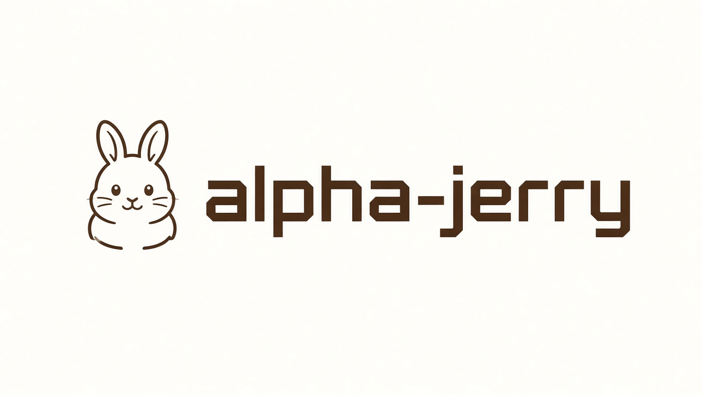

# alpha-jerry



本地 CLI：Tushare 采集 → 规则评分 → DeepSeek / GLM 锐评，输出荐股 Top20。数据只留在本机。

## 快速开始

需要 [Tushare](https://tushare.pro) VIP（5000 积分）和 DeepSeek 或 GLM 的 API Key。Windows / macOS，用下面的脚本装依赖（自动选最快 PyPI：官方或清华/阿里云）。

先进入本仓库目录。入口是 `uv run alpha-jerry`，换目录会找不到命令。

```bash
cd /path/to/alpha-jerry
python3 scripts/uv_sync.py              # Windows 可用 py -3 scripts/uv_sync.py
cp .env.example .env
# 填写 TUSHARE_TOKEN，以及 DEEPSEEK_API_KEY 或 GLM_API_KEY

uv run alpha-jerry --help               # 查看全部命令
uv run python scripts/sw_industry.py    # 首次约 11 分钟
uv run alpha-jerry collect
uv run alpha-jerry scores
uv run alpha-jerry models                 # 查看目录与当前偏好
uv run alpha-jerry models use glm         # 切到 GLM（.env 默认型号）
uv run alpha-jerry models use deepseek    # 切到 DeepSeek
uv run alpha-jerry models use glm glm-5-turbo
uv run alpha-jerry report                 # 使用刚才记住的选择
```

`models use <deepseek|glm> [型号]` 只改本地偏好，不跑锐评。不写型号时用 `.env` 里该 Provider 的默认模型。`report --provider` / `--model` 仍可单次覆盖。

产物在 `data/fin/`。

## 免责声明

输出仅供参考，不构成投资建议。
