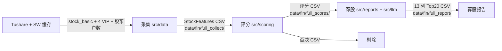

# alpha-jerry


> A 股基本面分析的本地命令行工具：Tushare 采集 → 一票否决 → 三维评分 → 行业加权评级 → LLM 锐评，帮助个人投资者识别优质公司。数据本地存储，仅 LLM 推理外联。

**当前阶段**：1.0.0。采集（含股东户数）→ 评分 → 荐股 Top20 → CLI 契约 → 微信 iLink 直连已落地。主入口是 `alpha-jerry`；`scripts/full_*.py` 仍可用。

## 快速开始

支持 Windows / macOS；Python 3.12 由 `.python-version` 固定，`uv sync` 自动下载。

采集走 Tushare VIP 接口（`income_vip` / `balancesheet_vip` / `cashflow_vip` / `fina_indicator_vip` 等），账号**付费积分至少 5000**，否则全量采集会失败。Token 填入 `.env` 的 `TUSHARE_TOKEN`；积分获取见 [官方说明](https://tushare.pro/document/1?doc_id=13)，频次对应表见 [doc_id=290](https://tushare.pro/document/1?doc_id=290)。

```bash
uv sync                                              # 安装依赖 + Python 3.12
cp .env.example .env                                 # 采集需填 TUSHARE_TOKEN（VIP 需 5000 积分）

uv run python scripts/sw_industry.py                 # 申万行业缓存（首次 ~11 分钟）
uv run python scripts/full_collect.py                # 全量批量采集 → data/fin/full_collect/
uv run python scripts/full_scores.py                 # 评分评级 → data/fin/full_scores/
uv run alpha-jerry status --check                    # 新鲜退出 0，过期或缺失退出 4
uv run alpha-jerry collect --update                  # 仅在过期时采集；--force 强采
uv run alpha-jerry collect --codes 600519.SH         # 单股即时采集（含股东户数）
uv run alpha-jerry scores                            # 读 raw 评分
uv run alpha-jerry models                            # 查看模型 ID、端点与默认配置
uv run alpha-jerry report                            # 交互选择 Provider + 具体模型 → Top20
uv run alpha-jerry report --provider glm --model glm-5-turbo
uv run python scripts/full_report.py                 # 兼容入口，使用 LLM_PROVIDER
uv run python scripts/smoke_collect.py --sample 5    # 随机 5 股冒烟

uv run pytest -m "not network"                       # mock 测试（CI 同款）
uv run ruff check . && uv run ruff format --check .  # lint + 格式
```

### API Key 本地存储

- 环境变量或 `.env` 中的 `DEEPSEEK_API_KEY` / `GLM_API_KEY` 优先。
- 未配置时，交互终端使用隐藏输入，并可保存到 macOS Keychain 或 Windows Credential Locker。
- API Key 不支持命令行参数，避免进入 shell history；非交互环境必须预先配置密钥。

### 模型与接口

模型目录于 2026-09-15 根据官网正文、接口示例与价格页交叉核验；可用 `--model` 输入后续发布的自定义模型 ID。

- DeepSeek：`deepseek-flash`（默认，V4.1 Flash）/ `deepseek-v4-pro`；OpenAI Base URL 为 `https://api.deepseek.com`。两者均支持 1M 上下文、最大 384K 输出、思考开关及 `low/high/max` 推理强度，详见 [官方模型与价格](https://api-docs.deepseek.com/quick_start/pricing)。
- 智谱 GLM：`glm-5.3-flash`（默认）/ `glm-5.3` / `glm-5.2` / `glm-5-turbo` / `glm-5.1` / `glm-5`；OpenAI Chat Base URL 为 `https://open.bigmodel.cn/api/paas/v4/`，详见 [官方模型概览](https://docs.bigmodel.cn/cn/guide/start/model-overview)。
- `glm-5.3` 与 `glm-5.3-flash` 均支持 1M 上下文和最大 128K 输出，强制开启思考，推理强度为 `low/high/max`；Flash 额外支持图片、视频和文件输入。

### 模型选择与自动记忆

- 首次运行 `uv run alpha-jerry report` 会依次显示 Provider 与模型菜单；选择后自动保存到 `data/cache/llm_preferences.json`。
- 之后运行无需选择，自动沿用上次选择；`.env` 中的 `DEEPSEEK_MODEL` / `GLM_MODEL` 仅作为无偏好时的兜底。
- 本次不想覆盖记忆时使用 `--no-save`；显式传 `--provider` 时仍会在运行后更新记忆。

### 微信 iLink 登录与收发

直连 `https://ilinkai.weixin.qq.com`，仅私聊。会话文件在 `data/wechat/session.json`（不含 token），token 写入系统钥匙串。

```bash
uv run alpha-jerry wechat login     # 二维码写入 data/wechat/qrcode.txt，手机扫码
# 先在微信里给机器人发一条消息，以便保存 context_token
uv run alpha-jerry wechat serve     # 长轮询：帮助 / 状态 / 报告 / 更新 / 持仓 / 加仓 / 减仓 / 查
uv run alpha-jerry wechat push --text 测试
uv run alpha-jerry wechat status
```

`push` 若尚未收到过入站消息，会退出 4 并提示先发一条微信。会话过期（协议 `-14`）时 `serve` 退出 2，需重新 `login`。iLink 为境内域名，默认 `WECHAT_TRUST_ENV=false`，避免被 `all_proxy` 劫持。

### 定时新鲜度检查

`alpha-jerry status --check`：采集 / 评分 / 报告均新鲜时退出 0，任一过期或缺失退出 4，适合 launchd 与任务计划程序。

macOS `launchd` 示例（`~/Library/LaunchAgents/com.alpha-jerry.status.plist`）：

```xml
<?xml version="1.0" encoding="UTF-8"?>
<!DOCTYPE plist PUBLIC "-//Apple//DTD PLIST 1.0//EN" "http://www.apple.com/DTDs/PropertyList-1.0.dtd">
<plist version="1.0">
<dict>
  <key>Label</key><string>com.alpha-jerry.status</string>
  <key>ProgramArguments</key>
  <array>
    <string>/usr/bin/env</string>
    <string>uv</string>
    <string>run</string>
    <string>alpha-jerry</string>
    <string>status</string>
    <string>--check</string>
  </array>
  <key>WorkingDirectory</key><string>/path/to/alpha-jerry</string>
  <key>StartCalendarInterval</key>
  <array>
    <dict><key>Hour</key><integer>9</integer><key>Minute</key><integer>0</integer></dict>
    <dict><key>Hour</key><integer>17</integer><key>Minute</key><integer>0</integer></dict>
  </array>
</dict>
</plist>
```

Windows 任务计划程序（每天 09:00 / 17:00）：

```bat
schtasks /create /tn alpha-jerry-status /sc daily /st 09:00 /tr "uv run alpha-jerry status --check"
```

微信侧摘要时刻由 `WECHAT_DIGEST_TIMES=09:00,17:00` 控制，需保持 `wechat serve` 在跑。

### 双端注意事项

- Python 3.12，LF，文件读写显式 UTF-8；Windows 终端无 `WT_SESSION` 时会尝试开启 VT，失败则无色 ASCII
- `--json` 永不打印 banner；非 TTY 默认静默品牌图
- CI 矩阵：`ubuntu-latest` / `windows-latest` / `macos-latest`
- macOS 设了 `all_proxy=socks5://...` 时，LLM 走 `httpx[socks]`；微信请求不要走该代理
- 系统自带 Python 3.9 不满足要求，`uv sync` 会按 `.python-version` 下载 3.12

## 技术栈

Python 3.12 · uv · pydantic-settings · Tushare Pro · DeepSeek / GLM（OpenAI 兼容接口）· keyring · httpx · pytest · ruff

## 核心功能

流水线：采集 → 评分 → 规则结论 → LLM 锐评出 Top20；CLI 与微信复用同一套工具。

- 采集：Tushare VIP 拉全市场财务特征与股东户数，人读/raw 双落盘，见 `src/data/`
- 评分：一票否决 + 三维分 + 行业加权评级，见 `src/scoring/scores.py`
- 规则结论：公司类型与操作建议，见 `src/reports/evaluation.py`
- 锐评报告：DeepSeek / GLM 写亮点 / 风险 / 点评，出 13 列 Top20，见 `src/llm/` 与 `src/reports/generator.py`
- CLI / 微信：`src/tools/` 契约 + `src/wechat/` iLink 私聊收发与定时摘要

## 项目结构

```
src/
├── cli.py                 # argparse 总入口
├── banner.py              # 侏儒兔 banner 三档降级
├── config.py              # Settings
├── data/                  # 采集：contract / provider / collect / holders / store
├── scoring/scores.py      # 否决、三维分、综合分、评级
├── reports/               # 荐股：evaluation / facts / generator / reporting
├── llm/                   # 双 Provider 锐评
├── tools/                 # CLI 契约：status / market / holdings / report / wechat
└── wechat/                # iLink 直连：登录 / 收发 / 推送
scripts/                   # full_collect / full_scores / full_report / sw_industry
tests/  integrated_tests/  # 单测镜像 src / 集成测试
assets/icon/               # 巧克力色侏儒兔品牌资产
data/                      # 运行期产物，不入库
docs/                      # brd（业务 + RIGID 规则）
```

## 数据流



## 定位

- **本地优先**：数据不上云，仅 LLM 推理外联
- **规则可审计**：否决 / 评分 / 评级为纯函数 + 全阈值边界单测
- **组合已有，不自研 Agent**：本项目只做内核、LLM 锐评子系统、CLI 工具封装与微信 iLink 直连

## 免责声明

本项目输出仅供参考，不构成投资建议。投资决策由用户自行完成并自担风险。
