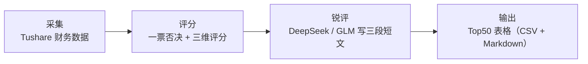

# alpha-yoki 使用手册

面向没有编程经验的用户：从安装 uv 开始，一步一步在 macOS 和 Windows 上跑通 alpha-yoki，最终拿到一份荐股 Top50 表格。每一步都写明「输入什么」和「应该看到什么」。功能总览见 [README.md](README.md)，评分规则见 [docs/brd.md](docs/brd.md)，版本变更见 [CHANGELOG.md](CHANGELOG.md)。

> [!IMPORTANT]
> 本工具输出仅供参考，不构成投资建议。

## 目录

- [1. 开始之前](#1-开始之前)
- [2. 安装](#2-安装)
- [2.5 无 GitHub 路线](#25-无-github-路线)
- [3. 配置密钥](#3-配置密钥)
- [4. 第一次完整跑通](#4-第一次完整跑通)
- [5. 日常使用](#5-日常使用)
- [6. 可选：微信直连](#6-可选微信直连)
- [7. 文件都在哪里](#7-文件都在哪里)
- [8. 常见问题与排错](#8-常见问题与排错)
- [9. 更新与卸载](#9-更新与卸载)
- [免责声明](#免责声明)

## 1. 开始之前

### 1.1 它做什么

alpha-yoki 是一个在你自己电脑上运行的命令行工具，整个流程分四步：



1. 采集：从 Tushare 下载全部 A 股的财务数据（含股东户数）。
2. 评分：按固定规则做一票否决，再给每只股票打成长性、稳健性、资金回报三个分，按行业加权得到综合分和评级。
3. 锐评：把综合分前 50 的股票交给大模型（DeepSeek 或智谱 GLM），写核心亮点、风险提示、点评三段短文。
4. 输出：得到一张 13 列的 Top50 表格，保存在项目的 `data/` 文件夹里。

所有数据只保存在本机，不上传云端。

### 1.2 需要准备什么

- 一台 macOS 或 Windows 10 / 11 电脑，能上网，磁盘预留约 2 GB
- 一个 [Tushare](https://tushare.pro) 账号，积分达到 5000（采集用的 VIP 接口硬性要求）
- 一个大模型 API Key：[DeepSeek](https://platform.deepseek.com) 或 [智谱 GLM](https://open.bigmodel.cn)，二选一即可
- 第一次完整跑通约 1 小时，其中大部分是等待下载和采集
- 打不开 GitHub、也没有 VPN 时：项目文件夹需由别人拷给你，安装步骤改走 [2.5](#25-无-github-路线)

Tushare 积分的获取方式见官方 [积分获取办法](https://tushare.pro/document/1?doc_id=13)。大模型 API 按用量计费，先充少量金额即可。Tushare、DeepSeek、智谱、微信都是国内站点，配好环境后不需要翻墙。

### 1.3 认识终端

本手册所有操作都在「终端」里输入命令完成。

| 项目 | macOS | Windows |
| :-- | :-- | :-- |
| 打开方式 | 按 `Command + 空格`，输入 `终端`，回车 | 按 `Win` 键，输入 `PowerShell`，回车 |
| 推荐程序 | 系统自带「终端」 | Windows Terminal（Windows 11 自带；Windows 10 可从 Microsoft Store 安装），中文和颜色显示更正常 |
| 粘贴命令 | `Command + V` | 在窗口里点鼠标右键 |
| 中止命令 | `Control + C` | `Ctrl + C` |

本手册的约定：

- 代码块里的命令一行一条，整行复制、粘贴、回车即可，前面没有需要去掉的 `$` 或 `>` 符号
- 标注「macOS」的代码块在终端里用，标注「Windows」的在 PowerShell 里用，标注「两端相同」的两边一样
- 命令执行完会回到一行以路径或用户名结尾、光标闪烁的提示符，表示可以输入下一条命令

### 1.4 几个名词

- 项目目录：解压、克隆或别人拷给你的 `alpha-yoki` 文件夹，所有命令都必须在这个目录里执行
- Token / API Key：一串类似密码的字符，用来证明「你是你」，不要发给别人
- `.env` 文件：项目目录里的纯文本配置文件，密钥填在这里；文件名以点开头，在 Finder / 资源管理器里默认隐藏
- 退出码：每条命令结束时留下的数字，`0` 成功、`2` 配置有问题、`3` 上游服务（Tushare / 大模型）出错、`4` 数据缺失或过期

## 2. 安装

能打开 GitHub 时按 2.1 到 2.4 做。打不开 `github.com`、也没有 VPN 时，**不要**执行 2.1 和 2.2，直接看 [2.5](#25-无-github-路线)。

### 2.1 安装 uv

uv 是一个 Python 工具管理器。装好它以后，Python 3.12 和项目依赖都由它自动下载，你不需要单独安装 Python。

macOS：

```bash
curl -LsSf https://astral.sh/uv/install.sh | sh
```

装了 Homebrew 的 Mac 也可以用 `brew install uv`。

Windows：

```powershell
powershell -ExecutionPolicy ByPass -c "irm https://astral.sh/uv/install.ps1 | iex"
```

也可以用 `winget install --id=astral-sh.uv -e`。

装完后关闭终端窗口，重新打开一个，再验证（两端相同）：

```bash
uv --version
```

看到类似 `uv 0.10.4` 的版本号就成功了。提示找不到命令，先确认已经重开终端，再看 [8.1](#81-安装阶段)。官方安装说明见 [uv Installation](https://docs.astral.sh/uv/getting-started/installation/)。

### 2.2 获取项目代码

方式 A（推荐，不需要 git）：打开仓库页面 [github.com/Jerrybao99/alpha-yoki](https://github.com/Jerrybao99/alpha-yoki)，点绿色的 `Code` 按钮，选 `Download ZIP`，下载后解压。解压出的文件夹名通常是 `alpha-yoki-main`，建议改名为 `alpha-yoki`。

方式 B（已经会用 git）：

```bash
git clone https://github.com/Jerrybao99/alpha-yoki.git
```

然后进入项目目录。假设文件夹放在「下载」里：

macOS：

```bash
cd ~/Downloads/alpha-yoki
```

Windows：

```powershell
cd $HOME\Downloads\alpha-yoki
```

> [!TIP]
> 不确定路径时，先输入 `cd` 和一个空格，再把文件夹从 Finder / 资源管理器拖进终端窗口，路径会自动填上，然后回车。路径里有空格时要用英文双引号包起来。

验证是否在正确的目录（两端相同）：

```bash
ls
```

应该看到 `README.md`、`pyproject.toml`、`src`、`scripts` 等名字。以后每次打开新终端，都要先做这一步 `cd`。

### 2.3 安装依赖

在项目目录里执行（两端相同）：

```bash
uv sync
```

第一次会自动下载 Python 3.12 和全部依赖包（几百 MB），需要几分钟。结束时会看到类似 `Installed 60 packages` 的字样，项目目录里多出一个 `.venv` 文件夹。

中国大陆网络下载慢或超时时，改用清华镜像：

```bash
uv sync --default-index https://pypi.tuna.tsinghua.edu.cn/simple
```

电脑上已经装有 Python 3 的话，README 里的 `scripts/uv_sync.py` 会自动测速并选最快的源：macOS 用 `python3 scripts/uv_sync.py`，Windows 用 `py -3 scripts/uv_sync.py`。没装 Python 的电脑不必用这个脚本，`uv sync` 就够了。这一步若卡在下载 Python 或访问 GitHub，停下来改走 [2.5](#25-无-github-路线)。

### 2.4 验证安装

```bash
uv run alpha-yoki
```

会看到一只字符画的兔子（旧版 Windows 控制台里是纯 ASCII 版本、没有颜色，属于正常降级）和命令列表，末尾一行是：

```text
退出码：0 成功 · 2 配置 · 3 上游 · 4 数据缺失/过期
```

到这里安装完成。`uv run alpha-yoki` 就是这个工具的命令前缀，后面每条命令都以它开头。

### 2.5 无 GitHub 路线

打不开 [github.com](https://github.com)、也没有 VPN 时走本节。后面第 3 到第 6 章用到的 [Tushare](https://tushare.pro)、[DeepSeek](https://platform.deepseek.com)、[智谱](https://open.bigmodel.cn)、微信都是国内站点，不需要翻墙。

本节完全不访问 GitHub，顺序是：拿到项目文件夹 → 装官方 Python 3.12 → 用清华 PyPI 装 uv → 用本机 Python 装依赖。

**第一步：拿到项目文件夹**

本仓库的官方地址只在 GitHub，没有国内镜像。请已经有完整代码的人，用微信、网盘或 U 盘发给你整个 `alpha-yoki` 文件夹（或 zip）。只发 `USER_GUIDE.md` 一个文件不够。

解压后进入该目录。假设放在「下载」里：

macOS：

```bash
cd ~/Downloads/alpha-yoki
ls
```

Windows：

```powershell
cd $HOME\Downloads\alpha-yoki
ls
```

必须能看到 `README.md`、`pyproject.toml`、`src`、`scripts`。缺任何一个都不是完整项目。

**第二步：安装 Python 3.12**

不要从 python.org 或 GitHub 下载。打开清华镜像目录 [3.12.10](https://mirrors.tuna.tsinghua.edu.cn/python/3.12.10/)（打不开就换 [华为云同一目录](https://mirrors.huaweicloud.com/python/3.12.10/)）。

| 系统 | 下载哪个文件 | 怎么安装 |
| :-- | :-- | :-- |
| macOS | `python-3.12.10-macos11.pkg` | 双击打开，一直点「继续」直到完成 |
| Windows（常见） | `python-3.12.10-amd64.exe` | 打开后先勾选 Add python.exe to PATH，再点 Install Now |
| Windows（ARM） | `python-3.12.10-arm64.exe` | 同上，先勾选 Add python.exe to PATH |

装完后**关闭终端，重新打开一个**，再 `cd` 回项目目录，验证版本：

macOS：

```bash
python3 --version
```

Windows：

```powershell
py -3.12 --version
```

应看到 `Python 3.12.10`。提示找不到命令，回到安装程序确认 Windows 已勾选 PATH，或把 pkg / exe 再装一遍。

**第三步：用清华源安装 uv**

macOS：

```bash
python3 -m pip install -i https://pypi.tuna.tsinghua.edu.cn/simple uv
```

Windows：

```powershell
py -3.12 -m pip install -i https://pypi.tuna.tsinghua.edu.cn/simple uv
```

验证（两端相同）：

```bash
uv --version
```

看到类似 `uv 0.10.4` 即成功。提示找不到 `uv` 时，后面所有命令把开头的 `uv` 换成下面的写法，效果相同：

| 系统 | 把 `uv` 换成 |
| :-- | :-- |
| macOS | `python3 -m uv` |
| Windows | `py -3.12 -m uv` |

例如 Windows 验证安装写成 `py -3.12 -m uv run alpha-yoki`。

**第四步：安装项目依赖**

必须加上 `--no-python-downloads`，否则 uv 会去 GitHub 再下一份 Python。

两端相同（找不到 `uv` 时按上表替换开头）：

```bash
uv sync --python 3.12 --no-python-downloads --default-index https://pypi.tuna.tsinghua.edu.cn/simple
```

结束时应看到类似 `Installed 60 packages`，项目目录里多出 `.venv`。清华源失败时，把地址换成 `https://mirrors.aliyun.com/pypi/simple` 再执行一次。

然后去做 [2.4](#24-验证安装)。从第 3 章起，步骤与能打开 GitHub 的用户完全相同。以后若再执行 `uv sync`，也要带上 `--python 3.12 --no-python-downloads --default-index https://pypi.tuna.tsinghua.edu.cn/simple`。

备选：不想先装 Python 时，可用中国科学技术大学的 GitHub Release 镜像装 uv。必须先指定下载地址，否则安装脚本仍会访问 GitHub。该镜像只同步最新一个版本，缺文件会跳回 GitHub；失败就回到上面的第二步。说明见 [USTC GitHub Release](https://mirrors.ustc.edu.cn/help/github-release.html)。

macOS（两行都在同一个终端窗口执行）：

```bash
export UV_DOWNLOAD_URL=https://mirrors.ustc.edu.cn/github-release/astral-sh/uv/LatestRelease/
curl -sL https://mirrors.ustc.edu.cn/github-release/astral-sh/uv/LatestRelease/uv-installer.sh | sh
```

Windows（两行都在同一个 PowerShell 窗口执行）：

```powershell
$env:UV_DOWNLOAD_URL="https://mirrors.ustc.edu.cn/github-release/astral-sh/uv/LatestRelease/"
powershell -ExecutionPolicy ByPass -c "irm https://mirrors.ustc.edu.cn/github-release/astral-sh/uv/LatestRelease/uv-installer.ps1 | iex"
```

## 3. 配置密钥

### 3.1 创建 .env

项目自带模板 `.env.example`。复制一份改名为 `.env`，再用记事本类工具打开编辑。

macOS：

```bash
cp .env.example .env
open -a TextEdit .env
```

Windows：

```powershell
Copy-Item .env.example .env
notepad .env
```

编辑规则：

- 每行是 `名字=值`，等号两边不要空格，值不要加引号
- 以 `#` 开头的行是说明，不用改
- 只改本章提到的几行，其他保持默认
- 改完保存（macOS `Command + S`，Windows `Ctrl + S`），然后关闭编辑器

> [!WARNING]
> `.env` 里是你的密钥。不要截图发给别人，不要上传网盘。项目的 `.gitignore` 已经排除了它，不会被提交到 git。

### 3.2 填 Tushare Token

1. 打开 [tushare.pro](https://tushare.pro)，注册并登录。
2. 点右上角头像进入「个人主页」，找到「接口 TOKEN」并复制（页面布局以官网为准）。
3. 确认积分不低于 5000，不够时按 [积分获取办法](https://tushare.pro/document/1?doc_id=13) 处理，否则采集会失败。
4. 在 `.env` 里找到 `TUSHARE_TOKEN=`，把 token 粘到等号后面。

```ini
TUSHARE_TOKEN=粘贴你的token
```

### 3.3 填大模型 API Key

DeepSeek 和智谱 GLM 二选一，填一家即可。两家都填时，一家生成失败会自动切到另一家。

DeepSeek：登录 [DeepSeek 开放平台](https://platform.deepseek.com)，在「API keys」里创建一个 key 并复制（只显示一次），再充值。

```ini
DEEPSEEK_API_KEY=粘贴你的key
```

智谱 GLM：登录 [智谱开放平台](https://open.bigmodel.cn)，在「API 密钥」里创建一个 key 并复制。

```ini
GLM_API_KEY=粘贴你的key
```

不想把 key 写进文件也可以留空：第一次运行 `report` 时终端会提示输入（输入时屏幕不显示任何字符，这是正常的），并询问是否保存到 macOS 钥匙串 / Windows 凭据管理器，回车即保存，之后不再询问。`.env` 里有值时优先用 `.env`。

### 3.4 其他可选项

以下配置保持默认即可，遇到具体问题再改。完整清单和注释见 [.env.example](.env.example)。

| 配置项 | 默认值 | 什么时候改 |
| :-- | :-- | :-- |
| `LLM_PROVIDER` | `deepseek` | 没有记住过模型偏好时的默认厂商，只填了 GLM 就改成 `glm` |
| `DEEPSEEK_MODEL` / `GLM_MODEL` | `deepseek-flash` / `glm-5.3-flash` | 想默认用更强的型号时改，可选型号见 `uv run alpha-yoki models` |
| `CONCURRENCY` | `4` | 网络较差、采集频繁报错时改小到 `2` |
| `TUSHARE_RATE_LIMIT` | `500` | 5000 积分档的每分钟调用上限，积分档位不同时按 Tushare 官网表调整 |
| `REVIEW_CACHE_ENABLED` | `true` | 同一份数据重复生成报告时直接用本地缓存、不重复付费，想强制重新生成时改为 `false` |
| `WECHAT_*` | 见文件 | 只在使用微信功能时需要看，见第 6 章 |

### 3.5 检查配置是否生效

```bash
uv run python -m src.main
```

会打印一份不含密钥的状态清单，重点看这三行是不是「是」：

```text
  Tushare 已配置: 是
  DeepSeek Key  : 是
  GLM Key       : 否
```

大模型 key 只需要一家是「是」。

## 4. 第一次完整跑通

前提：已完成第 2、3 章，终端已 `cd` 到项目目录。全程约 30 到 60 分钟，大部分时间在等待。

### 4.1 生成行业分类缓存

```bash
uv run python scripts/sw_industry.py
```

给全部 A 股查一遍申万行业并归入五大类（周期资源 / 大消费 / 证券金融 / 科技·制造 / 公用事业·基建），结果存到 `data/ref/sw_industry.csv`。耗时约 11 分钟，每 500 只打印一次进度，最后一行是 `完成: xxxx/xxxx 已分类`。

这一步只需要做一次。跳过它也能采集，但第一次 `collect` 会在采集过程中逐只补查行业，慢很多。

### 4.2 采集数据

```bash
uv run alpha-yoki --json collect
```

批量模式通常几分钟完成。结束时打印一行 JSON，重点看 `"ok": true`、`period` 和 `success_count`：

```text
{"ok": true, "command": "collect", "data": {"skipped": false, "period": "20260630", "path": "data/fin/full_collect/260917.csv", "success_count": 5000, "failure_count": 20}, "error": null}
```

`period` 是本次采集的财报报告期（`20260630` 表示 2026 年半年报）。少量股票失败属正常，例如刚上市或财报未披露。

> [!NOTE]
> 为什么加 `--json`：`collect`、`scores`、`status`、`screen`、`holdings` 这几条命令成功时默认不打印任何文字，直接回到提示符。加上 `--json`（必须放在子命令前面）就能看到结果。不加也是正常执行了的。

中途按了 `Ctrl + C` 或断网了，重新执行时加 `--resume`，会跳过当天已经采到的股票：

```bash
uv run alpha-yoki --json collect --resume
```

### 4.3 评分

```bash
uv run alpha-yoki --json scores
```

十几秒内完成。输出里 `passed` 是通过一票否决并完成评分的股票数，`vetoed` 是被否决的股票数。被否决的股票和原因写在 `data/fin/full_scores/YYMMDD-否决.csv`。

### 4.4 选择大模型

```bash
uv run alpha-yoki models use glm
```

填的是 DeepSeek 就把 `glm` 换成 `deepseek`。终端回显 `已切换为 glm / glm-5.3-flash`。这一步只是记住偏好，不联网、不花钱。

### 4.5 生成报告

```bash
uv run alpha-yoki report
```

依次发生：

1. 打印 `已应用上次选择：glm / glm-5.3-flash`，以及 `Provider`、`Model`、`Fallback` 三行。`Fallback` 显示另一家模型，只配了一家 key 时显示「规则模板」。
2. `.env` 里没填 key 时，这里提示 `请输入 glm API Key（输入隐藏）:`，粘贴后回车；再问 `保存到系统钥匙串？[Y/n]:`，直接回车。
3. 逐只打印进度 `[ 1/50] 股票名 | success | 核心亮点……`，共 50 行，通常几分钟。
4. 最后两行是 `锐评状态：success=xx ...` 和 `荐股 Top50 产出：data/fin/full_report/YYMMDD.csv`。

进度里的状态含义：

| 状态 | 含义 |
| :-- | :-- |
| `success` | 模型生成并通过校验 |
| `retry` | 首次校验未通过，重试后通过 |
| `switched` | 主模型失败，切到另一家模型后通过 |
| `fallback` | 模型不可用，使用规则模板文案，数字和评级仍然可靠 |
| `cache_hit` | 同一份数据之前生成过，直接用本地缓存 |

### 4.6 查看结果

报告在 `data/fin/full_report/` 里，文件名是日期 `YYMMDD`：

- `YYMMDD.csv`：Excel / WPS / Numbers 双击即可打开，中文不会乱码
- `YYMMDD.md`：同样内容的 Markdown 版本，任意文本编辑器可读

打开这个文件夹：macOS 输入 `open data/fin/full_report`，Windows 输入 `explorer data\fin\full_report`。

13 列说明：

| 列 | 来源 | 说明 |
| :-- | :-- | :-- |
| 股票代码、股票名称 | 数据 | 6 位代码 |
| 公司类型 | 规则 | 🐎 千里马 / 🐮 现金牛 / 🛡 护城河 |
| 行业分类 | 数据 | 五大类之一 |
| 核心亮点 | 模型 | 30 字内 |
| 成长性、稳健性、回报性 | 规则 | 各 0 到 10 分 |
| 综合分 | 规则 | 三维按行业权重加权，0 到 10 |
| 评级 | 规则 | 见下表 |
| 操作建议 | 规则 | 按评级映射，含仓位区间 |
| 风险提示 | 模型 | 40 字内 |
| 点评 | 模型 | 50 字内 |

评级与操作建议的对应关系：

| 综合分 | 评级 | 操作建议 |
| :-- | :-- | :-- |
| 8.5 及以上 | 👑 皇冠明珠 | 重仓买入（10-20%） |
| 7.0 到 8.4 | ⭐ 优秀白马 | 分批建仓（5-10%） |
| 5.5 到 6.9 | 🔄 鸡肋·观察 | 观望/波段（<3%） |
| 5.5 以下 | ⚠️ 垃圾 | 坚决回避（0%） |

数字与评级全部由规则计算，模型只负责写文字，而且模型文字里出现的数字必须能在财报数据中找到，否则会被打回重写。完整阈值见 [docs/brd.md](docs/brd.md)。

## 5. 日常使用

### 5.1 通用规则

- 每次打开新终端先 `cd` 到项目目录，否则会提示找不到命令或找不到数据
- 所有命令都以 `uv run alpha-yoki` 开头
- `--json` 要写在子命令前面：`uv run alpha-yoki --json status` 正确，`uv run alpha-yoki status --json` 会报错 `unrecognized arguments`
- 命令没有输出就回到提示符，多数情况是成功；不放心就查退出码，macOS 输入 `echo $?`，Windows 输入 `echo $LASTEXITCODE`，`0` 即成功
- 每条子命令都有帮助，例如 `uv run alpha-yoki collect --help`

### 5.2 数据过期了吗

```bash
uv run alpha-yoki --json status
```

输出里有 `collect`、`scores`、`report` 三项，看每项的 `reason`：`fresh` 新鲜，`stale` 过期，`missing` 还没生成过。

「过期」以法定披露截止日为准：一季报 4 月 30 日、半年报 8 月 31 日、三季报 10 月 31 日、年报次年 4 月 30 日。过了截止日，工具就认为应该有新一期数据，旧产物标记为 `stale`。因此通常在每年 5 月初、9 月初、11 月初各更新一次即可。

`status --check` 在过期或缺失时以退出码 `4` 结束，供定时任务判断。

### 5.3 更新数据

按顺序执行三条命令：

```bash
uv run alpha-yoki --json collect --update
uv run alpha-yoki --json scores
uv run alpha-yoki report
```

`--update` 只在过期或缺失时真正采集，数据仍新鲜时输出 `"skipped": true, "reason": "fresh"`，这时后两条可以不跑。想无视新鲜度重采，把 `--update` 换成 `--force`。已生成过锐评的股票会命中本地缓存，重跑 `report` 花费很少。

### 5.4 只采几只股票

```bash
uv run alpha-yoki --json collect --codes 600519.SH 000858.SZ
```

代码要带交易所后缀：沪市 `.SH`、深市 `.SZ`、北交所 `.BJ`。结果写到 `data/fin/full_collect/YYMMDD-单股.csv`，只供查看，不参与评分和报告。

> [!WARNING]
> `scores --codes` 会用筛选后的少数几行覆盖当天的全量评分文件。做过全量评分后不要再单独跑它；确实要用时加 `--date` 换一个文件名，例如 `--date 260917a`。想看单只股票的评分，直接用 Excel 打开评分 CSV 搜索代码更稳妥。

### 5.5 按行业和评级筛选

```bash
uv run alpha-yoki --json screen --industry 大消费 --rating 皇冠
```

两个条件都是「包含即匹配」，可以只给一个。行业只能是五大类名称（周期资源 / 大消费 / 证券金融 / 科技/制造 / 公用事业/基建），评级关键词用 `皇冠`、`白马`、`鸡肋`、`垃圾`。输出是 JSON，开头的 `count` 是匹配数量，后面是每只股票的完整数据行，内容很长。想舒服地浏览，用 Excel 打开 `data/fin/full_scores/YYMMDD.csv`，对「行业分类」「评级」两列做筛选。

### 5.6 记录持仓

```bash
uv run alpha-yoki holdings add 600519.SH --name 贵州茅台
uv run alpha-yoki --json holdings list
uv run alpha-yoki holdings remove 600519.SH
```

持仓保存在 `data/hold/holdings.csv`，只是一份本地清单，供微信「持仓」指令和定时摘要使用，不做任何交易。

### 5.7 切换或临时更换模型

```bash
uv run alpha-yoki models
uv run alpha-yoki models use deepseek
uv run alpha-yoki models use glm glm-5.3
uv run alpha-yoki report --provider deepseek --no-save
```

`models` 列出两家的型号目录和当前偏好。`models use` 改写偏好，可选带型号。`report --provider` 本次覆盖偏好，会再问一次型号（回车用默认），加 `--no-save` 表示不改写记住的偏好。

### 5.8 命令速查

| 命令 | 作用 |
| :-- | :-- |
| `uv run alpha-yoki --help` | 查看全部命令 |
| `uv run alpha-yoki --json status` | 采集 / 评分 / 报告是否过期 |
| `uv run alpha-yoki status --check` | 过期或缺失时退出码 4 |
| `uv run alpha-yoki --json collect` | 全量采集 |
| `uv run alpha-yoki --json collect --update` | 过期或缺失时才采集 |
| `uv run alpha-yoki --json collect --force` | 强制重采 |
| `uv run alpha-yoki --json collect --resume` | 断点续采 |
| `uv run alpha-yoki --json collect --codes 600519.SH` | 只采指定股票 |
| `uv run alpha-yoki --json scores` | 对最新采集结果评分 |
| `uv run alpha-yoki --json screen --industry 大消费 --rating 皇冠` | 本地筛选，不联网 |
| `uv run alpha-yoki holdings add / list / remove` | 持仓增删查 |
| `uv run alpha-yoki models` | 模型目录与当前偏好 |
| `uv run alpha-yoki models use glm` | 记住用 GLM，不调模型 |
| `uv run alpha-yoki report` | 生成 Top50 锐评，会调用大模型 |
| `uv run alpha-yoki wechat login / status / serve / push` | 微信直连，见第 6 章 |

### 5.9 进阶：定时更新

想让电脑自动更新，把下面这行放进 macOS 的 launchd 或 Windows 的「任务计划程序」定期执行。定时任务没有交互终端，所以 `report` 必须写明 `--provider`，密钥必须已写在 `.env` 或已保存到钥匙串。定时器本身的配置方法不在本手册范围内。

macOS：

```bash
uv run alpha-yoki status --check || (uv run alpha-yoki collect --update && uv run alpha-yoki scores && uv run alpha-yoki report --provider glm)
```

Windows：

```powershell
uv run alpha-yoki status --check; if ($LASTEXITCODE -eq 4) { uv run alpha-yoki collect --update; uv run alpha-yoki scores; uv run alpha-yoki report --provider glm }
```

## 6. 可选：微信直连

本功能直连腾讯 iLink（微信 Cloud Bot / ClawBot），让你在手机微信里查看报告、触发更新。前提：

- 手机微信已开通 Cloud Bot / ClawBot 插件（常见于较新的 iOS 微信）
- 本机已按第 4 章跑通过一次报告

### 6.1 扫码登录

```bash
uv run alpha-yoki wechat login
```

终端打印 `请用微信 ClawBot 扫描：data/wechat/qrcode.png`，然后原地等待。打开这张二维码图片：macOS 输入 `open data/wechat/qrcode.png`，Windows 输入 `Invoke-Item data\wechat\qrcode.png`。用手机微信扫码并在手机上确认。成功后终端打印 `已登录`。

二维码 4 分钟内有效，超时会提示 `登录超时` 或 `二维码已过期`，重新执行 `login` 即可。登录凭证存在系统钥匙串里，`data/wechat/session.json` 只存会话元数据。

检查登录状态：

```bash
uv run alpha-yoki --json wechat status
```

`"logged_in": true` 表示已登录，`false` 就重新 `login`。

### 6.2 保持在线

```bash
uv run alpha-yoki wechat serve
```

这条命令会一直运行，不会回到提示符，运行期间终端没有输出。只有它在运行时，微信里的消息才会被回复，定时摘要才会发出。要停止就按 `Ctrl + C`，终端会打印一段以 `KeyboardInterrupt` 结尾的文字，属正常停止。

`serve` 挂着时，默认每天 09:00 和 17:00 各推送一条「数据新鲜度 + 持仓」摘要，时间在 `.env` 的 `WECHAT_DIGEST_TIMES` 里改。

> [!TIP]
> 电脑休眠后 `serve` 会停止收消息。macOS 可以改用 `caffeinate -i uv run alpha-yoki wechat serve` 启动，运行期间系统不会闲置休眠；Windows 在「电源和睡眠」设置里把接通电源时的睡眠改为「从不」。

### 6.3 微信里能说什么

先给机器人发「帮助」，它会回复全部指令。

| 类型 | 指令 | 说明 |
| :-- | :-- | :-- |
| 只读，直接回复 | 帮助 / 状态 / 持仓 | 用法、数据新鲜度、持仓清单 |
| 只读，直接回复 | 报告 / 摘要 | 把本机已生成的 Top50 转成 Markdown 发回，不调用大模型 |
| 只读，直接回复 | 查 600519 | 单只股票的名称、行业、股东户数、评级 |
| 只读，直接回复 | 筛选 大消费 皇冠 | 按行业（五大类）和评级筛选，返回数量和前 5 只 |
| 需要确认 | 更新 / 全量采集 / 评分 / 锐评 | 分别对应 `collect --update`、`collect --force`、`scores`、`report` |
| 需要确认 | 加仓 600519 / 减仓 600519 | 修改本地持仓清单 |

「需要确认」的指令会先回一句「识别到 …，回复「确认」执行，回复「取消」放弃」，2 分钟内回复「确认」才执行。股票代码可以不带后缀，`600519` 会自动补成 `600519.SH`。

默认只回复扫码登录的那个微信号，群聊消息一律忽略。要允许其他人，让对方先给机器人发一条消息，然后在 `data/wechat/session.json` 的 `contexts` 里找到对方的 id，填进 `.env` 的 `WECHAT_ALLOWED_USERS`（多个用英文逗号隔开），再重启 `serve`。

### 6.4 主动推送

```bash
uv run alpha-yoki --json wechat push --text "你好"
```

向最近一次和机器人对话的人发一条文本。第一次使用前必须先在微信里给机器人发过至少一条消息，否则提示 `先在微信里给机器人发一条消息`。

### 6.5 会话过期

`serve` 运行中如果打印 `session_expired` 并退出，说明微信侧会话已失效，重新执行 `wechat login` 即可。

## 7. 文件都在哪里

所有产物都在项目目录下的 `data/` 里，文件名里的 `YYMMDD` 是生成日期（如 `260917` 表示 2026 年 9 月 17 日）。

| 路径 | 内容 |
| :-- | :-- |
| `data/fin/full_collect/YYMMDD.csv` | 全量采集结果，中文列头，可用 Excel 打开 |
| `data/fin/full_collect/YYMMDD-raw.csv` | 同一份数据的机读版本，供评分读取，不要手动编辑 |
| `data/fin/full_collect/YYMMDD-单股.csv` | `collect --codes` 的结果 |
| `data/fin/full_scores/YYMMDD.csv` | 评分结果，末尾多出成长性、稳健性、资金回报、综合分、评级五列 |
| `data/fin/full_scores/YYMMDD-否决.csv` | 被一票否决的股票及原因 |
| `data/fin/full_report/YYMMDD.csv` | 荐股 Top50，13 列 |
| `data/fin/full_report/YYMMDD.md` | 同一份 Top50 的 Markdown 版本 |
| `data/ref/sw_industry.csv` | 行业分类缓存，第一次生成后长期复用 |
| `data/hold/holdings.csv` | 本地持仓清单 |
| `data/cache/llm_preferences.json` | 记住的模型偏好 |
| `data/cache/review/` | 锐评缓存，删除后下次 `report` 会重新调用模型 |
| `data/monitor/review-YYMMDD.jsonl` | 锐评过程追踪日志，排错时看 |
| `data/monitor/wechat-YYMMDD.jsonl` | 微信收发追踪日志，已脱敏 |
| `data/wechat/` | 微信登录二维码与会话元数据 |

`data/` 不会被提交到 git。删除整个 `data/` 相当于恢复到刚安装的状态，需要重新跑第 4 章。

## 8. 常见问题与排错

先看退出码（[5.1](#51-通用规则)），再按下面的分类找。

| 退出码 | 含义 | 一般处理 |
| :-- | :-- | :-- |
| `2` | 配置问题 | 检查 `.env`、密钥、命令拼写、微信是否登录 |
| `3` | 上游服务失败 | 检查网络、大模型余额和 key，稍后重试 |
| `4` | 数据缺失或过期 | 先跑前置步骤（采集 → 评分 → 报告） |

### 8.1 安装阶段

`uv: command not found` 或 `无法将“uv”项识别为 cmdlet`：uv 没装成功，或安装后没有重开终端。先重开终端再试。能打开 GitHub 时重跑 2.1；打不开 GitHub 时按 [2.5](#25-无-github-路线) 用 `python3 -m uv` 或 `py -3.12 -m uv` 代替 `uv`。

Windows 提示「在此系统上禁止运行脚本」：2.1 的官方命令自带 `-ExecutionPolicy ByPass`，请完整复制那一整行；仍不行就改用 `winget install --id=astral-sh.uv -e`，或按 2.5 用 `pip` 安装 uv。

macOS 弹出「需要安装命令行开发者工具」的对话框：是因为运行了 `python3 scripts/uv_sync.py`。点「取消」，改用 `uv sync` 或 2.5 的 `uv sync --python 3.12 --no-python-downloads`。

`uv sync` 很慢、超时，或卡在下载 Python：能打开 GitHub 时用 2.3 的清华镜像。打不开 GitHub 时不要等，改走 [2.5](#25-无-github-路线)，用本机已装的 Python 3.12 并加上 `--no-python-downloads`。

打开 `github.com` 失败、`astral.sh` 失败、或 `git clone` 一直转圈：这是网络拦了 GitHub，不是项目坏了。按 [2.5](#25-无-github-路线) 做，不要用来路不明的「GitHub 加速站」。

### 8.2 配置阶段

`未配置 TUSHARE_TOKEN，请在 .env 填入`：`.env` 不存在、没保存、不在项目目录，或被存成了 `.env.txt`。用 `ls -a`（macOS）或 `Get-ChildItem -Force`（Windows）确认项目目录里有名为 `.env` 的文件，再用 3.5 的命令检查。

`缺少 glm API Key。请设置 GLM_API_KEY，或在交互终端运行命令以保存到系统钥匙串`：出现在定时任务或非交互场景。把 key 写进 `.env`，或先在普通终端里手动跑一次 `report` 并保存到钥匙串。

`非交互终端必须显式指定 --provider deepseek 或 --provider glm`：定时任务里给 `report` 加上 `--provider`。

`系统钥匙串不可用，API Key 仅用于本次运行`：本机没有可用的钥匙串服务，把 key 写进 `.env` 即可。

### 8.3 采集与评分

`Tushare 调用失败（重试 3 次仍报错）`：最常见的原因是积分不足 5000、token 填错、调用频率超限或网络中断。登录 tushare.pro 确认积分，等一分钟后重跑，中断过的采集加 `--resume`。

`success_count` 很小或 `failure_count` 很大：报告期数据可能还没披露完。用 `--period` 指定上一期，例如 `uv run alpha-yoki --json collect --period 20260331`。

`没有可续的采集文件，请先 collect`：`--resume` 只能续当天的采集，今天还没采过就去掉 `--resume`。

`无采集数据，请先运行 collect` / `无评分数据，请先运行 scores` / `无评分 CSV，请先运行 full_scores.py`：前置步骤还没做，按 4.2 → 4.3 → 4.5 的顺序执行。

### 8.4 报告阶段

`LLM 报告生成失败（…Error）`，退出码 3：网络、key 无效或余额不足。检查 key 和账户余额后重跑，已成功的股票会命中缓存不再计费。细节在 `data/monitor/review-YYMMDD.jsonl`。

大部分股票的状态是 `fallback`：模型没能返回合格文案，工具用规则模板兜了底。数字和评级不受影响，等网络或余额恢复后重跑 `report` 会自动替换成模型文案。

`报告写盘失败`：报告文件正在被 Excel 打开占用，关闭后重跑。

### 8.5 显示与文件

命令没有任何输出：对 `status`、`collect`、`scores`、`screen`、`holdings` 来说是正常的，加 `--json` 或查退出码。

`alpha-yoki: error: unrecognized arguments: --json`：`--json` 放到了子命令后面，改成 `uv run alpha-yoki --json <命令>`。

Windows 下中文乱码或兔子变成方块：换用 Windows Terminal，或在终端设置里把字体改成支持中文的字体。旧控制台下 banner 自动退化为纯 ASCII，不影响任何功能。

Excel 打开 CSV 乱码：人读 CSV 自带 BOM，Excel 可以直接双击打开；`-raw.csv` 没有 BOM，需要通过「数据 → 从文本导入」并选 UTF-8，但这些文件本来就不是给人看的。

### 8.6 微信

`未登录，请先运行 wechat login`：还没扫码或会话已失效。

`先在微信里给机器人发一条消息`：`push` 需要一次入站消息才能拿到会话，先在微信里随便发一句。

机器人不回复：确认 `serve` 正在运行、发消息的微信号就是扫码的那个（或已加入 `WECHAT_ALLOWED_USERS`）、不是在群聊里发的。

## 9. 更新与卸载

### 9.1 更新项目

用 ZIP 方式安装的：重新下载并解压新版本，把旧文件夹里的 `.env` 文件和 `data/` 文件夹复制进新文件夹，然后在新文件夹里执行 `uv sync`。打不开 GitHub 时，请对方再发一份新 zip，同样先拷 `.env` 和 `data/`，再按 [2.5 第四步](#25-无-github-路线) 带镜像参数执行 `uv sync`。用 git 且能访问 GitHub 的：

```bash
git pull
uv sync
```

### 9.2 更新 uv

用官方脚本安装的 uv 可以自我更新：

```bash
uv self update
```

用 Homebrew 或 winget 安装的，分别用 `brew upgrade uv`、`winget upgrade --id=astral-sh.uv -e`。按 2.5 用 pip 安装的，macOS 执行 `python3 -m pip install -i https://pypi.tuna.tsinghua.edu.cn/simple --upgrade uv`，Windows 执行 `py -3.12 -m pip install -i https://pypi.tuna.tsinghua.edu.cn/simple --upgrade uv`。

### 9.3 卸载

1. 删除整个项目文件夹，`data/` 和 `.env` 都在里面，一并删除。
2. 删除保存过的密钥：macOS 打开「钥匙串访问」搜索 `alpha-yoki` 并删除条目；Windows 打开「控制面板 → 凭据管理器 → Windows 凭据」，删除名称含 `alpha-yoki` 的普通凭据。
3. 不再需要 uv 时，按 [uv 卸载说明](https://docs.astral.sh/uv/getting-started/installation/#uninstallation) 处理。

## 免责声明

输出仅供参考，不构成投资建议。
